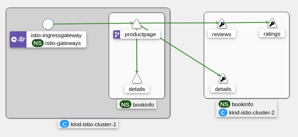

# KubeCon EU 2024

Demo for https://kccnceu2024.sched.com/event/1YeSP

## Usage

Create the demo environment with:

```shell
make demo
```

Generate some traffic with:

```shell
JWT_TOKEN=$(curl -s https://raw.githubusercontent.com/istio/istio/release-1.20/security/tools/jwt/samples/demo.jwt)

curl -v -H "Authorization: Bearer ${JWT_TOKEN}" --cacert _output/certs/kind-istio-cluster-1/cert-chain.pem \
    --resolve bookinfo.kubecon:31443:127.0.0.1 https://bookinfo.kubecon:31443/productpage
```

Visualize the traffic in Kiali (http://localhost:30201):



## Clean up

Clean up the environment with:

```shell
make clean
```
